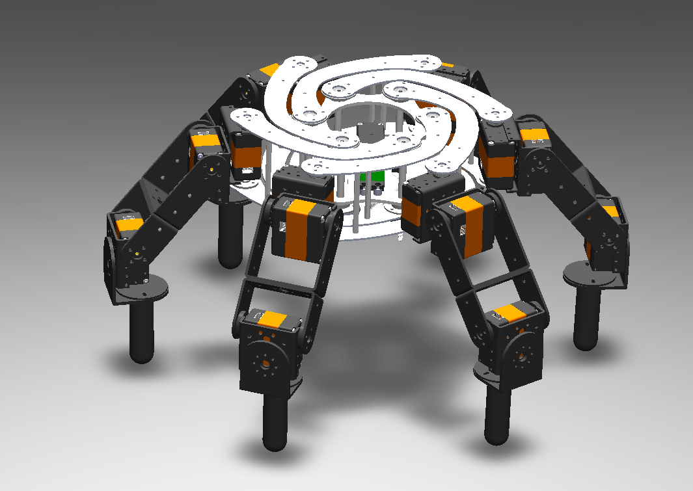
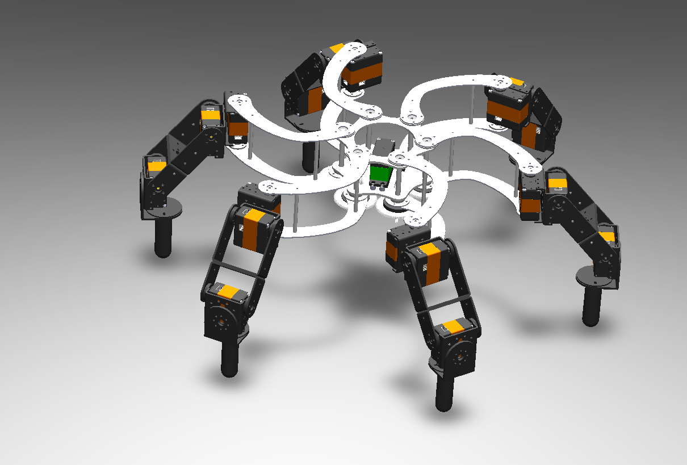
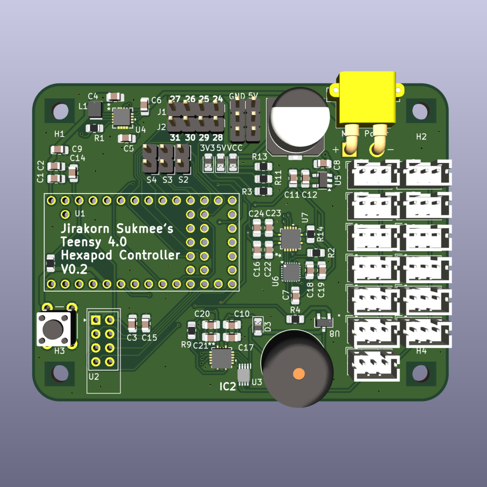
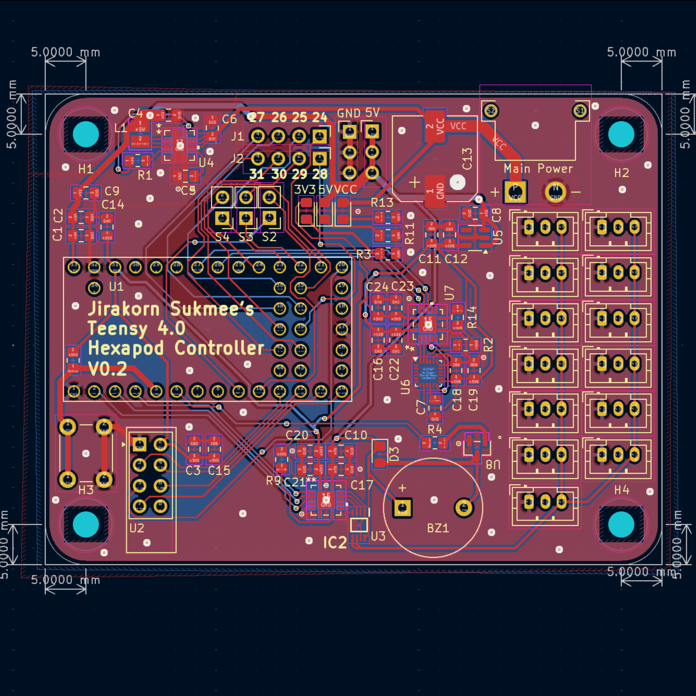

# Project: Morphex Rotating Arm

This is a WIP project I'm working on. It'll take years to gather knowledge and the budget to actually build it.

## TODO
1. Remodel brackets and servo.
2. Think about materials more.
3. Cost analysis.

## Pictures
Hexapod:

PCB:

## Costs
**15/12/2024 01:49:**
- $274.51 for All CNC machined parts (so far)
- ~$30 for small hardware pieces (Spacers, Threaded Rods, Bearings,)
- $815.78 for all 33 servos and controllers (with metal horns) 1x HTS-35H, 32x HTD-45H
- $64.18 for brackets to mount each legs
- $72.54 for Custom PCB and Electronics (for now)

**Total:** $1,184.49

## Progress
**15/12/2024 01:48:**
- I have a working model with the original servos. The model is usable and can be visualized.
- Electronics haven't been selected yet but [HiWonder Controller](https://www.hiwonder.com/products/serial-bus-servo-controller) and [HTS-35H Servos](https://www.hiwonder.com/collections/bus-servo/products/hts-35h) are good combos

**15/12/2024 13:30:**
- I have to wait until new years to buy a servo to measure it's dimensions and remodel the servo's CAD model 
- Haven't decided on materials yet, but cnc'ed aluminum for high stress parts and maybe ASA/ABS for the rest

**18/12/2024 13:30:**
- I have remade the model to use HTD-45H servos

**20/12/2024 22:36:**
- Remade a few parts to actually fit read world designs and store bought parts.

**17/01/2025 20:48:**
- Finalized Custom PCB (I think). Ready to be ordered and assembled.
